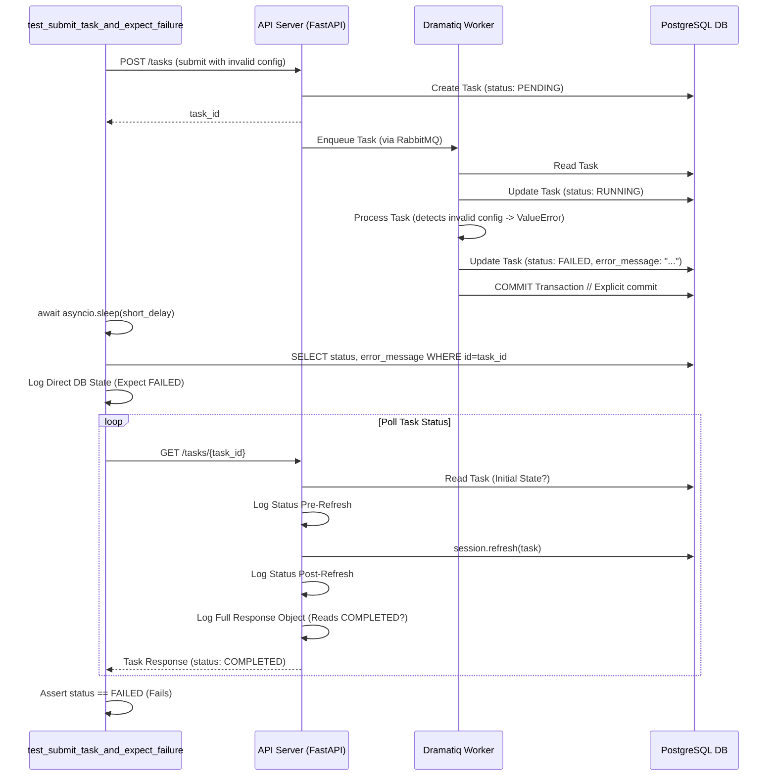

# PLANNING: Step 7.2.12 - Debug `test_submit_task_and_expect_failure` Status Discrepancy

**Date:** 2025-04-13

**Objective:** Diagnose and resolve the issue where the `test_submit_task_and_expect_failure` E2E test incorrectly observes a `COMPLETED` status via the API, despite the worker correctly setting the status to `FAILED` and committing the transaction.

**Context:**
- Task 7.2 is partially complete. The primary DB visibility issue (stale `RUNNING` status) was resolved by adding an explicit `await session.commit()` in the worker logic.
- `test_submit_task_and_poll_completion` and `test_concurrent_task_submissions` now pass.
- `test_submit_task_and_expect_failure` fails because the API polling loop reads `COMPLETED` immediately after the worker commits `FAILED`. Worker logs confirm the `FAILED` status is set and committed correctly.

**Hypothesis:**
The root cause likely lies in transaction visibility or timing within the E2E test environment. Possibilities include:
1.  The API's database session reads stale data despite `session.refresh()`, potentially due to transaction isolation levels or subtle timing issues between the worker commit and the API read.
2.  An unexpected secondary update overwrites the `FAILED` status very quickly before the API can read it.
3.  Interaction between the test fixtures managing the database, API, and worker processes might be causing session state issues.

**Strategy:**
Introduce targeted logging to observe the database state directly at critical points during the test execution and review transaction handling configurations.

**Detailed Steps:**

1.  **Add Direct DB State Logging in Test:**
    *   Modify `ops-core/tests/integration/test_live_e2e.py` specifically within `test_submit_task_and_expect_failure`.
    *   After the point where the worker is expected to have finished processing (allowing a short buffer, e.g., `await asyncio.sleep(1)`), add code to directly query the database using the test's `db_session` fixture.
    *   Log the `status` and `error_message` retrieved directly from the DB *before* the API polling loop begins.

2.  **Add Enhanced Logging in API Endpoint:**
    *   Modify the `get_task` endpoint in `ops-core/src/ops_core/api/v1/endpoints/tasks.py`.
    *   *Before* the `session.refresh(db_task)` call, log the status of `db_task`.
    *   *After* the `session.refresh(db_task)` call, log the status again.
    *   Log the full `TaskResponse` object just before returning it.

3.  **Review Transaction Isolation Levels:**
    *   Inspect the SQLAlchemy engine creation in `ops-core/tests/conftest.py` (for tests) and potentially `ops_core/dependencies.py` (for runtime).
    *   Document the current default isolation level.
    *   As a diagnostic step, explicitly set a stricter isolation level (e.g., `REPEATABLE READ` or `SERIALIZABLE`) for the test database engine in `conftest.py` and re-run the failing test to see if behavior changes.

4.  **Analyze Fixture Session Handling:**
    *   Review how the `db_session`, `live_api_server`, and `live_dramatiq_worker` fixtures in `ops-core/tests/conftest.py` manage database sessions and connections, especially concerning scope and potential interactions between the different processes.

**Visualization:**

**Expected Outcome:**
This plan should help pinpoint *why* the API reads `COMPLETED`. We expect to see if the DB state itself is `FAILED` right after the worker commit (as seen by the test process) and exactly what state the API reads before/after refresh. This will narrow down whether it's a read consistency issue, a timing problem, or an unexpected data overwrite.