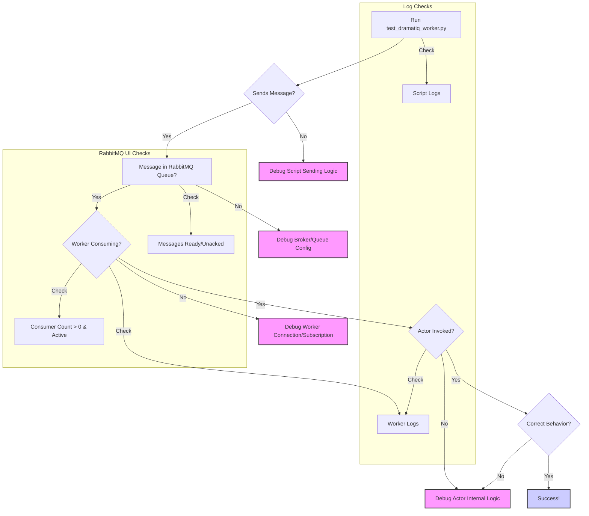

# Planning: Task 7.2 - Step 2: RabbitMQ Debugging

**Date:** 2025-04-12

**Objective:** Diagnose why the Dramatiq worker (`execute_agent_task_actor`) is not being invoked when messages are sent via the `test_dramatiq_worker.py` script by observing RabbitMQ state.

**Context:**
- Task 7.2 is focused on debugging live E2E test failures.
- An isolation script (`test_dramatiq_worker.py`) is being used to test the worker independently.
- Logs confirm the worker starts, connects to RabbitMQ, and discovers the actor.
- The RabbitMQ management UI port (15672) has been exposed.
- The immediate issue is that the actor function doesn't seem to run when a message is sent.

**Plan:**

1.  **Verify RabbitMQ UI Access:**
    *   Confirm accessibility of the RabbitMQ management interface at http://localhost:15672.
    *   Log in using credentials `guest`/`guest`.
    *   *Purpose:* Ensure the service is running and accessible after the `docker-compose.yml` change.

2.  **Execute Test Script & Observe RabbitMQ UI:**
    *   Run the `test_dramatiq_worker.py` script.
    *   Simultaneously monitor the `default` queue (or the specific queue used by the actor) in the RabbitMQ management UI.
    *   Observe:
        *   **Messages:** Arrival state (Ready/Unacked), count.
        *   **Consumers:** Presence (>0), activity status.
    *   *Purpose:* Track the message flow and worker connection status in real-time.

3.  **Analyze Findings:**
    *   Correlate UI observations with script/worker logs.
    *   Determine the failure point based on the analysis flow below.
    *   *Purpose:* Pinpoint whether the issue lies in message sending, broker delivery, worker consumption, or actor invocation.

4.  **Refine Debugging:**
    *   Based on the analysis, plan the next specific debugging actions (e.g., more logs, inspect message content, check worker config).
    *   *Purpose:* Formulate targeted next steps to resolve the identified failure point.

**Conceptual Flow Diagram:**

**Next Step (After Plan Approval):** Switch to Debug mode to execute this plan.